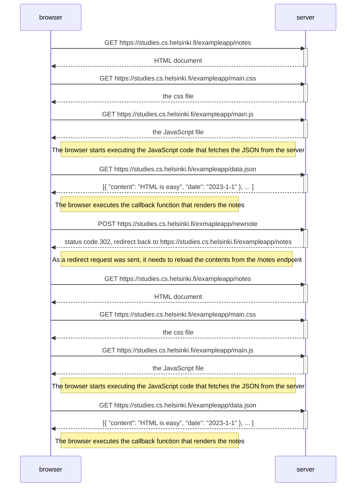

load notes file -> fetches from data endpoint -> renders on client side -> make request -> get redirection to notes file (effectively a reload) -> send a new request and load notes file again (but with all the new notes instead) -> fetches from data endpoint with new note -> renders on client side
