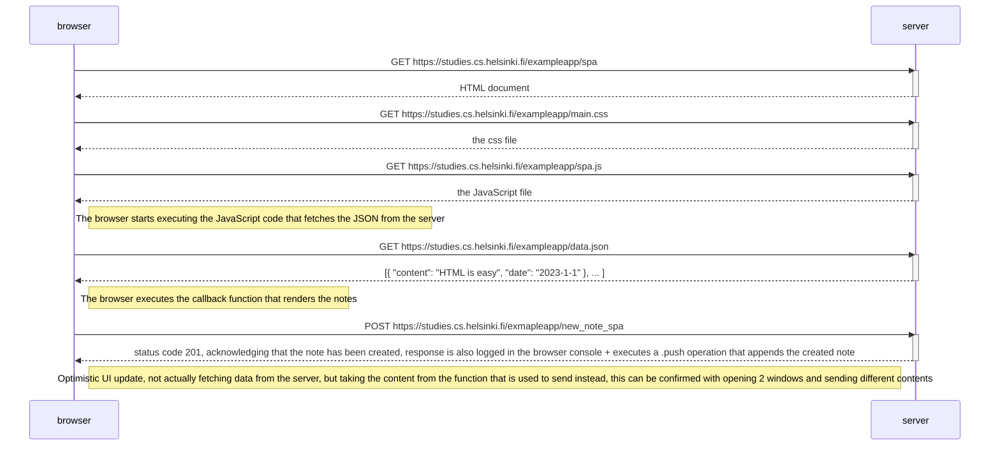

```mermaid
sequenceDiagram
 participant browser
 participant server

 browser->>server: GET https://studies.cs.helsinki.fi/exampleapp/spa
 activate server
 server-->>browser: HTML document
 deactivate server

 browser->>server: GET https://studies.cs.helsinki.fi/exampleapp/main.css
 activate server
 server-->>browser: the css file
 deactivate server

 browser->>server: GET https://studies.cs.helsinki.fi/exampleapp/spa.js
 activate server
 server-->>browser: the JavaScript file
 deactivate server

 Note right of browser: The browser starts executing the JavaScript code that fetches the JSON from the server

 browser->>server: GET https://studies.cs.helsinki.fi/exampleapp/data.json
 activate server
 server-->>browser: [{ "content": "HTML is easy", "date": "2023-1-1" }, ... ]
 deactivate server

    Note right of browser: The browser executes the callback function that renders the notes


 browser->>server: POST https://studies.cs.helsinki.fi/exmapleapp/new_note_spa
 activate server
 server-->>browser: status code 201, acknowledging that the note has been created, response is also logged in the browser console + executes a .push operation that appends the created note
 deactivate server

    Note right of browser: Optimistic UI update, not actually fetching data from the server, but taking the content from the function that is used to send instead, this can be confirmed with opening 2 windows and sending different contents
```

